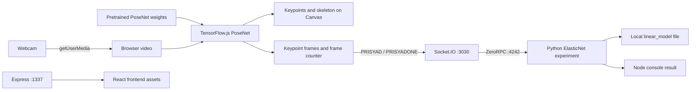

# VisionLabsHackathon

A team hackathon prototype for browser-based human pose estimation, skeleton visualization, and pose-frame streaming to an experimental exercise backend.

## Goal

Explore camera-based interaction through a fitness interface. The perception
pipeline is relevant to human–machine and potential human–robot interaction;
robot hardware integration is not implemented. No measured real-time guarantee
or recognition accuracy is available.

## Requirements

### Software

- Node.js 22 or 24 with npm; installation and production build verified with
  Node.js 24.4.0 / npm 11.4.2 on macOS. Node.js 22 has not been tested here.
- A browser with camera access, Canvas, and TensorFlow.js support. Use localhost
  or HTTPS and grant camera permission. External network access is needed for
  the pretrained PoseNet weights and the stylesheet CDN in `public/index.html`.
- The optional RPC experiment additionally needs a compatible ZeroMQ native
  Node binding and Python with `zerorpc`, `pandas`, `numpy`, `scikit-learn` and
  `matplotlib`. Original Python versions are not documented in the original
  repository; an end-to-end working Python environment has not been verified.

### Build

```sh
npm ci --omit=optional --legacy-peer-deps
npm run build-client
# Or run both steps:
sh build.sh
```

The lockfile is retained. Webpack was updated from 4.34.0 to 4.47.0 within the
same major version to build under OpenSSL 3 without the legacy crypto provider.
`socket.io-client` 2.2.0 is now a direct dependency because the camera imports it.
`zerorpc` keeps its original version but becomes optional: the frontend does not
need it and its historical native binding fails to compile on Node.js 24.
Omitting optional dependencies deliberately leaves the RPC server unavailable.
React, TensorFlow.js, and the model API remain on their historical versions.

### Running

```sh
npm start
```

Open `http://localhost:1337/prised/camera` for the webcam component; `PORT` changes
the web server port. `/fitnes` and `/prised` provide the historical exercise UI.
The camera attempts Socket.IO at `http://localhost:3030`; without the optional
backend it retries connection while local pose rendering remains independent.

For the backend experiment, first resolve the native binding and Python version
compatibility, install optional dependencies, then run separate terminals:

```sh
npm ci --include=optional --legacy-peer-deps
node backend/socket.js
# Separate terminal, from the repository root:
cd backend
python3 server.py
```

These backend commands are a source-derived startup recipe, not a verified
end-to-end setup. `backend/RPC.py` is an alternative echo-style RPC stub and
must not run alongside `server.py` on the same port (4242). `server.py` fits a
separate ElasticNet model from collected keypoints and reads/writes
`linear_model` relative to the current directory. It does not train PoseNet.

### Testing

```sh
npm run lint
npm test
npm run build-client
```

The original lint script fails because no ESLint configuration was committed.
The original test script fails because its three spec globs match no test files.
Neither is a passing test suite. See [docs/VALIDATION.md](docs/VALIDATION.md) for
actual verification and remaining compatibility issues.

## Implementation

### Architecture



### Main components and data flow

- `server/index.js` serves the generated frontend and route fallback.
- `client/components/Camera.js` captures video (default requested size 900 × 700),
  loads pretrained PoseNet, and schedules inference with `requestAnimationFrame`.
- `single-pose` is the default. A `multi-pose` prop enables the implemented
  `estimateMultiplePoses` branch (default maximum two detections); the UI does
  not expose a mode switch. Both branches are unverified in a live camera run.
- `utils.js` filters keypoints by confidence and draws points and adjacent
  skeleton segments. The preview is horizontally mirrored.
- **start** collects poses for roughly three seconds and schedules `PRISYAD`
  with a JSON-stringified array. **send one** schedules `PRISYADONE` with the
  latest frame every 150 ms for three seconds. Timer values are implementation
  settings, not measured inference rates or delivery guarantees.
- Each frame contains `keypoints` (PoseNet `part`, `score`, and `position.x/y`)
  and `cadr`, a frame counter. The backend derives timing rather than receiving
  a measured capture timestamp; evaluation assumes 30 frames/s.
- `SocketManager.js` forwards the events as RPC stages 1 and 2. Python fits an
  ElasticNet regression over selected coordinates or evaluates a saved model;
  the Node callbacks print results and do not deliver feedback to the browser.

### Security

The checked project source contains an empty `secrets.js`; no project credential
was identified in the targeted scan. This is not a certification of all git
history. The legacy dependency audit still reports vulnerabilities; do not expose
these prototype servers publicly without addressing them. The servers lack
application authentication and payload validation. Pose frames are transmitted
to the local backend when recording controls are used; camera images feed local
browser inference. Only load trusted model files: Python `pickle.load` can
execute code. The existing model, database, and media were preserved because
their provenance/reproducibility is incomplete.

### Attribution and contributions

This is a team hackathon project. Individual contribution is not documented in
the original repository. See [CONTRIBUTORS.md](CONTRIBUTORS.md) for confirmed git
authors, the original package author credit, and unresolved asset attribution.

## Conclusions

The source demonstrates a browser perception pipeline and a prototype bridge
from keypoints to Python regression. Runtime behavior, webcam permissions,
model downloads, and end-to-end exercise feedback have not been validated here.
The recorders can emit empty data and have timer races; animation loops,
streams, and sockets are not cleaned up on component unmount. Some menu routes
are placeholders; the home video source can remain an unresolved `Fitness`
string. The regression uses assumed timing and has no held-out evaluation.

### Demonstration and future measurements

Existing videos/GIFs are input/UI assets, not verified screenshots of successful
inference. No new screenshot or performance result is claimed. TODO: record a
real camera run with consent, then benchmark after model warmup. Record browser,
OS, device, TensorFlow backend, model version, resolution, mode and thresholds;
measure capture-to-inference and capture-to-backend latency separately, report
sample count and median/p95 latency, observed FPS and dropped frames. Compare
single/multiple-person modes and retain raw measurements.

## Topics Studied

- Browser camera APIs and Canvas rendering
- TensorFlow.js and pretrained PoseNet inference
- Human-pose keypoints, confidence thresholds, and skeleton visualization
- React components and frontend inference scheduling
- Socket.IO events and ZeroRPC service integration
- Pose-frame serialization and Python feature transformation
- Experimental ElasticNet regression for exercise timing
- Human–machine interaction
